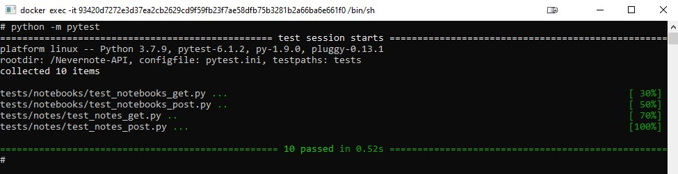

Nevernote API
---
#### Deploying via Docker

```
# Setup repo
git clone https://github.com/bdebenon/Nevernote-API.git
cd Nevernote-API

# Setup network
docker network create --driver bridge nevernote_network

# Setup database via dockerfile
docker build -t nevernote_database -f .\docker\database.dockerfile .
docker run --network=nevernote_network -d -p 5432:5432 --name nevernote_database nevernote_database

# Setup api via dockerfile
docker build -t nevernote_api -f .\docker\api.dockerfile .
docker run --network=nevernote_network -d -p 80:80 --name nevernote_api nevernote_api
```
---
#### Testing
Nevernote API uses the PyTest framework to conduct it's unit tests.
To start PyTest, simply run the follow from the root directory wherever you are running Flask.
(For example, if you are running it on a docker container, you would need to execute PyTest from inside the container.)

Note: config.ini must have the correct host set under [postgresql] depending on where you are running the test from. 
```
python -m pytest
```

---
#### API Documentation
Nevernote API uses RAML to automatically create documentation for the API.
Visit the documentation after running the API at

##### Usage
```
[IP_ADDRESS]:[PORT]/documentation
```
##### Example
```
http://localhost:80/documentation
```
---
#### Regenerating API Documentation
To regenerate the API documentation automatically you must do the following
##### Install NodeJS
```
https://nodejs.org/en/download/
```

##### Install raml2html
```
npm i -g raml2html
```

##### Generate raml file
From the root directory run the following command
```
python documentation/generate_raml_file.py
```
---

###### Written by Blake DeBenon